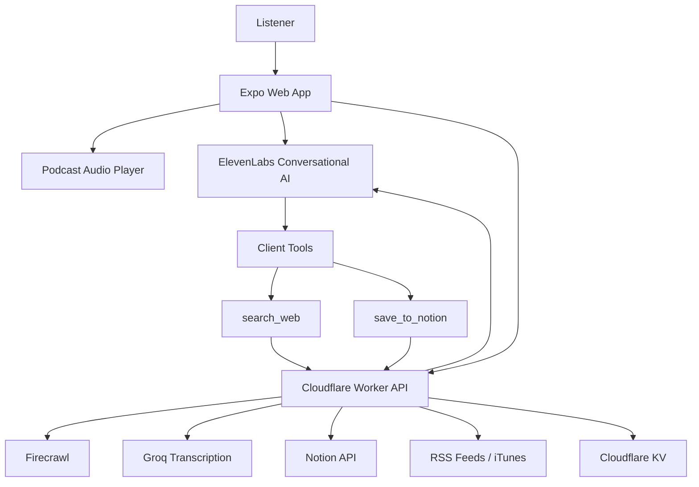

# Curio

> A voice-first podcast companion that listens with you, answers follow-up questions from transcript context plus live web grounding, and saves the best moments into Notion.

Curio is an Expo web app paired with a Cloudflare Worker. You play a podcast, interrupt it with "Ask Curio", talk to an ElevenLabs voice agent, and get answers grounded in what was just said plus live web search when the transcript is not enough. If an answer is worth keeping, Curio can save that moment into an episode page in Notion and keep appending to the same page over time.

This project was built for the ElevenLabs x Firecrawl hackathon.

## Overview

> You are 42 minutes into a podcast. A guest references a company, a study, or some old market event. You stop playback, ask Curio what they meant, and get an answer that uses the local transcript first and Firecrawl-backed web search only when it needs outside context. Then you say "save this to Notion" and Curio adds that moment to your episode page.

Curio is built around that loop:

1. Browse and play a podcast episode.
2. Interrupt playback and ask a spoken follow-up question.
3. Resolve the question against transcript context, show notes, and the episode arc so far.
4. Fall back to live search when the user is asking for background, current facts, names, or verification.
5. Save the finished Q&A moment into Notion, scoped to the current episode.

## What It Does

- Discovers podcasts and recent episodes from RSS feeds and iTunes search/top charts.
- Fetches transcripts from feed-provided transcript URLs when available and falls back to Groq transcription when needed.
- Builds episode context from recent transcript segments, show notes, and a lightweight episode summary.
- Runs an ElevenLabs conversation session with client tools for `search_web` and `save_to_notion`.
- Shows grounded web sources in the interrupt overlay.
- Creates or appends to a per-episode Notion page, then remembers that page via Cloudflare KV.

## Architecture



## Stack

| Layer | Tools |
| --- | --- |
| Frontend | Expo, React Native Web, TypeScript |
| Backend | Cloudflare Workers, TypeScript |
| AI | ElevenLabs React SDK, Groq Whisper |
| Integrations | Firecrawl, Notion |
| Storage | Cloudflare KV |

## Local Development

### 1. Install dependencies

```bash
npm install
cd worker && npm install
```

### 2. Configure the app

Copy the example file and fill in your values:

```bash
cp .env.example .env
```

Required app variables:

- `EXPO_PUBLIC_API_URL`
- `EXPO_PUBLIC_ELEVENLABS_AGENT_ID`

### 3. Configure the worker

Copy the worker env example:

```bash
cp worker/.dev.vars.example worker/.dev.vars
```

Required worker variables:

- `FIRECRAWL_API_KEY`
- `ELEVENLABS_API_KEY`
- `GROQ_API_KEY`

### 4. Set up Cloudflare KV

`worker/wrangler.toml` in this repo intentionally uses placeholder KV IDs so real Cloudflare resource IDs are not committed. Before running or deploying the worker, replace these with a real `TRANSCRIPT_KV` namespace:

- `id = "REPLACE_WITH_TRANSCRIPT_KV_ID"`
- `preview_id = "REPLACE_WITH_TRANSCRIPT_KV_PREVIEW_ID"`

Curio uses this KV namespace for:

- transcript caching and transcript job state
- Notion episode-page mapping

### 5. Run the app

For desktop web development:

```bash
npm run dev
```

That starts:

- the Expo web app
- the Cloudflare Worker on `http://localhost:8787`

## ElevenLabs Integration

Curio's voice layer is not just text-to-speech wrapped around a search box. The app starts an episode-specific ElevenLabs conversation session, fetches a signed URL for that session from the ElevenLabs backend, injects a fresh system prompt on every interrupt, streams partial responses into the overlay, and exposes client tools that the agent can call directly.

### Dynamic Session Bootstrapping

```ts
const { signedUrl } = await getSignedUrl(AGENT_ID);

await conversation.startSession({
  signedUrl,
  connectionType: 'websocket',
  dynamicVariables: {
    podcast_name: episode.podcastName || 'Podcast',
    episode_title: episode.title,
    playback_position: formatPlaybackPosition(interruptAt),
    host_names: episode.hostNames?.join(', ') || 'Unknown',
    current_date_human: currentDate.humanDate,
    current_date_iso: currentDate.isoDate,
    current_year: currentDate.year,
    current_timezone: currentDate.timeZone,
  },
  overrides: {
    agent: {
      prompt: { prompt: systemPrompt },
    },
  },
} as any);
```

Each Ask Curio interruption starts from the current episode, playback position, host list, and calendar context. The prompt is rebuilt per session so the model knows what is happening in the room right now, not just what the base agent was configured to do in the ElevenLabs dashboard.

### Client Tools as Part of the Conversation Loop

```ts
clientTools: {
  search_web: async (params: FirecrawlSearchParams) => {
    const results = await firecrawlSearch(params);
    const mappedSources = sourcesFromResults(results.results);
    dispatchM({ type: 'SET_SOURCES', sources: mappedSources });
    return formatSearchToolResult(params, results);
  },
  save_to_notion: async () => {
    const result = await saveCurrentTurnToNotion();
    return result.ok
      ? formatNotionToolResult(result.pageUrl, result.pageTitle, result.isNew)
      : `save_to_notion failed: ${result.message}`;
  },
}
```

This is the core interaction model. ElevenLabs decides when to call tools; the app executes them locally and feeds the results back into the same voice turn. `search_web` updates the source list shown in the UI, while `save_to_notion` targets the last completed answer rather than the empty save-request turn that triggered it.

### Context Injection Without Restarting the Session

```ts
const context = await getContext({
  episodeId: episode.id,
  positionMs: Math.floor(interruptAt * 1000),
  feedUrl: episode.feedUrl,
  episodeUrl: episode.link,
  episodeTitle: episode.title,
});

conversation.sendContextualUpdate(formatContextDump(episode, context));
```

After playback is interrupted, Curio fetches recent transcript slices, the episode arc so far, show notes, and lightweight web background, then sends that into the live ElevenLabs session as passive context. That keeps follow-up questions grounded in what was actually said in the podcast before the model reaches for the web.

## Firecrawl Integration

Curio uses Firecrawl as a structured grounding layer rather than a blind search fallback. The model can ask for web, news, or image results, and the worker constrains, times, and normalizes those requests before they ever reach the UI.

### Structured Search Requests

```ts
const data = await firecrawlSearch(env, {
  query: body.query.trim(),
  limit: includesImages ? 4 : 5,
  sources: normalizedSources,
  categories: body.categories && body.categories.length > 0 ? body.categories : undefined,
  tbs: body.tbs,
  location: body.location,
  country: 'US',
  timeout: FIRECRAWL_SEARCH_TIMEOUT_MS,
  ignoreInvalidURLs: true,
});
```

The agent prompt teaches Curio when to ask for `web`, `news`, or `images`, when to add recency via `tbs`, and when to prefer categories like `research`, `pdf`, or `github`. The worker then turns that into a bounded Firecrawl query tuned for this app's UI and response speed.

### Result Normalization for Voice and UI

```ts
return json({
  results: normalizeFirecrawlResults(data?.data),
  warning: data?.warning || null,
});
```

Firecrawl responses are normalized into a consistent shape before they hit the frontend. That gives Curio a stable source model for citation rows, image candidates, link titles, dates, and tool-return summaries, even when upstream result shapes vary.

## Key Flows

### Transcript-aware Q&A

Curio always tries to answer from what was already said in the room before it searches. The agent prompt explicitly prefers:

1. recent transcript
2. episode summary so far
3. show notes
4. live search only when outside information is needed

### Save to Notion

When the user asks to save, the agent calls `save_to_notion`, which:

1. takes the latest completed Q&A moment
2. sends it to the worker
3. creates or appends to the episode page in Notion
4. stores the episode-to-page mapping in KV
5. returns the page URL and title back to the UI

### Existing Episode Page Detection

On a fresh Ask Curio session, the app checks whether the current episode already has a Notion page. If the page was deleted in Notion, the worker clears the stale KV mapping and Curio stops showing it as existing.

## Why This Project Exists

Most podcast apps are good at playback and bad at follow-up. Once a guest references a paper, a company, or an event you do not recognize, your choices are usually:

- ignore it
- pause and manually search
- lose the thread

Curio turns podcast listening into an interactive research surface. It keeps the episode context live, answers inside the flow of listening, and lets you turn the best moments into a reusable study page instead of a forgotten voice exchange.
